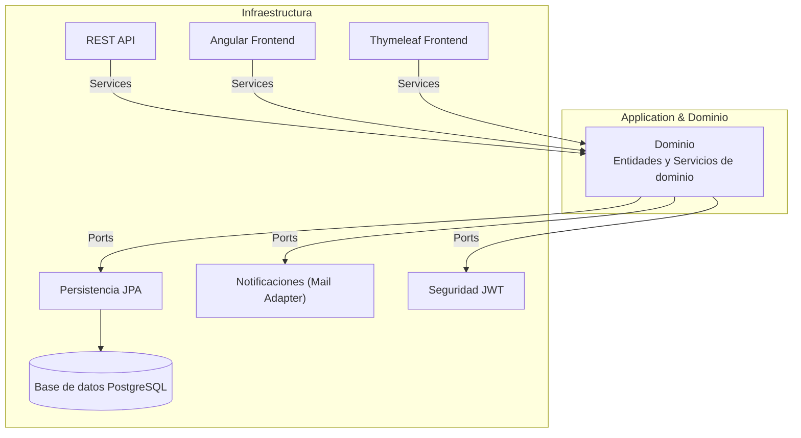

# Índice

1. [Visión general de la arquitectura](#visión-general-de-la-arquitectura)
2. [Estructura a alto nivel](#estructura-a-alto-nivel)
3. [📂 Builds](#-builds)
4. [📂 Modules](#-modules)
    - [Módulos de application](#módulos-de-application)
    - [Módulos de infrastructure](#módulos-de-infrastructure)
5. [📂 Scripts](#-scripts)

---

# Visión general de la arquitectura

El proyecto está diseñado siguiendo **Arquitectura Hexagonal (Ports & Adapters)** y principios de **Domain-Driven Design (DDD)**.  
El núcleo de la aplicación está aislado de los frameworks y de la infraestructura, lo que garantiza que las **reglas de negocio** sean independientes de tecnologías concretas (bases de datos, APIs, librerías, etc.).

La modularización con **Maven** refuerza esta separación: cada carpeta corresponde a un módulo con una responsabilidad clara.  
Las de


# Visión general de la arquitectura

El proyecto está diseñado siguiendo **Arquitectura Hexagonal (Ports & Adapters)** y principios de **Domain-Driven
Design (DDD)**.  
El núcleo de la aplicación está aislado de los frameworks y de la infraestructura, lo que garantiza que las **reglas de
negocio** sean independientes de tecnologías concretas (bases de datos, APIs, librerías, etc.).

La modularización con **Maven** refuerza esta separación: cada carpeta corresponde a un módulo con una responsabilidad
clara.  
Las dependencias siempre fluyen **hacia el dominio**, nunca al revés.

---

## Estructura a alto nivel

La representación general de los componentes, capas y flujos principales de un sistema, mostrando cómo interactúan entre
sí y con el mundo exterior, sin profundizar en la implementación concreta.

```text
.
├── builds
│   ├── knowy-devenv-compose
│   └── knowy-thymeleaf-compose
├── modules
│   ├── application
│   │   ├── base
│   │   ├── course
│   │   └── user
│   └── infrastructure
│       ├── backend-api-spring
│       ├── frontend-web-angular
│       ├── frontend-web-spring
│       ├── notification-spring-mail
│       ├── persistence-spring-jpa
│       └── security-spring-jwt
└── scripts
    └── init-postgresql
        └── sql
```

### Explicación de los bloques principales

- **📂 builds/** → Configuraciones auxiliares de despliegue (Docker Compose, entornos locales).
- **📂 modules/** → Núcleo de la aplicación.
    - **application/** → Casos de uso y orquestación de la lógica de negocio.
    - **infrastructure/** → Adaptadores técnicos (REST, UI, DB, seguridad, notificaciones).
- **📂 scripts/** → Scripts para inicializar y mantener la base de datos u otros servicios externos.



## 📂 Builds

Contiene configuraciones auxiliares necesarias para ejecutar la aplicación en diferentes entornos.
Por ejemplo:

- **knowy-devenv-compose/** → Configuración de Docker Compose para entorno de desarrollo.
- **knowy-thymeleaf-compose/** → Configuración de Docker Compose para pruebas con frontend Thymeleaf.

Estas carpetas permiten levantar servicios necesarios (bases de datos, servidores, colas de mensajes) de forma rápida y
reproducible

## 📂 Modules

Contiene el núcleo funcional de la aplicación, organizado en módulos claros según su responsabilidad:

- **application/** → Casos de uso y lógica de negocio.
- **infrastructure/** → Adaptadores que conectan el núcleo con el mundo exterior.

### Módulos de application

El módulo application contiene los casos de uso que coordinan la lógica de dominio y definen los ports que luego serán
implementados por la infraestructura.
Cada submódulo organiza los casos de uso por áreas de negocio.

```text
<application-module>
└── src
    ├── main
    │   └── java
    │       └── com.knowy.core
    │           ├── domain        # Entidades y servicios de dominio
    │           ├── exception     # Excepciones de aplicación
    │           ├── port          # Interfaces de entrada y salida (Ports)
    │           └── usecase       # Casos de uso de por area. Por ejemplo: manage, update, register...
    │           └── service.java
    └── test
        └── java
            └── com.knowy.core.usecase
                └── adjust      # Tests de los casos de uso
```

#### Explicación de carpetas

- **domain/** → Contiene las entidades y servicios de dominio, independientes de frameworks.
- **exception/** → Excepciones propias de la aplicación, usadas en la capa de casos de uso.
- **port/** → Define interfaces:
- **usecase/** → Casos de uso organizados por área de negocio (ej. lesson, course, exercise).
- **test/** → Contiene tests unitarios y de integración para los casos de uso.
- **service.java** → Clase que funciona como un Facade dentro del módulo de aplicación.
    - Su responsabilidad principal es coordinar múltiples casos de uso o ejecutar funciones transversales que no
      pertenecen a un solo caso de uso.
    - No contiene la lógica de negocio principal, que siempre se mantiene en los usecases.
    - Facilita la interacción de los adaptadores externos (REST, UI, CLI) con los casos de uso, proporcionando una
      interfaz simplificada y centralizada.
    - Permite organizar operaciones complejas que involucran varios casos de uso sin ensuciar la lógica interna de cada
      usecase.

### Módulos de infrastructure

Los módulos de infraestructura implementan los ports de salida (out) definidos en application y proporcionan adaptadores
para interactuar con sistemas externos como bases de datos, servicios REST, mensajería, notificaciones o seguridad.

```text
<infrastructure-module>
└── src
    ├── main
    │   ├── java
    │   │   └── com.knowy.<modulo>
    │   │       ├── adapter     # Implementación de ports de salida
    │   │       │   ├── dao        # Lógica de acceso a datos o servicio externo
    │   │       │   ├── entity     # Representación de la información externa (DB, API, etc.)
    │   │       │   └── mapper     # Convierte entre la representación externa y el dominio
    │   │       ├── client.java       # Clase transversal o Facade del adaptador (puede ser repository/client)
    │   │       └── <otras-clases>    # Otros componentes del adaptador según necesidad
    │   └── resources
    │       └── META-INF/<config>  # Configuración necesaria para el adaptador
    └── test
        └── java
            └── com.knowy.<modulo>
                └── adapter       # Tests unitarios e integración del adaptador
```

#### Explicación de carpetas

- **adapter/** → Implementa los ports de salida del módulo de aplicación. Contiene la lógica necesaria para conectarse a
  sistemas externos.
- **dao/** → Clases que ejecutan operaciones concretas sobre el sistema externo (base de datos, API, cola de mensajes,
  etc.).
- **entity/** → Representación de los datos externos de forma estructurada, independiente del dominio.
- **mapper/** → Convierte entre los datos externos (entity) y los objetos del dominio definidos en application.
- **client / repository (u otras clases del adaptador)** → Clases que pueden contener lógica transversal o
  específica del adaptador, coordinando varias operaciones sobre un sistema externo.
    - Funcionan como Facade del adaptador, exponiendo métodos que los casos de uso de application pueden invocar a
      través
      de los ports de salida.
    - No contienen lógica de negocio del dominio, que siempre se mantiene en los usecases.
    - Su rol depende del tipo de adaptador:
        - **client** → Maneja la comunicación con API externas o servicios remotos.
        - **repository / dao** → Encapsula operaciones de acceso a datos o persistencia.
- **resources/** → Archivos de configuración necesarios para que el adaptador funcione correctamente (Spring, JPA,
  conexión a API, etc.).
- **test/** → Tests unitarios e integración para asegurar que el adaptador cumple correctamente con los contracts de los
  ports de salida.

## 📂 Scripts

El directorio `init-postgresql` contiene todos los recursos necesarios para **levantar y poblar la base de datos de la
aplicación**. Actualmente, funciona de la siguiente manera:

```text
init-postgresql
├── init-postgresql.cmd      # Script para Windows que ejecuta la inicialización
├── init-postgresql.sh       # Script para Linux/Mac que ejecuta la inicialización
└── sql
    ├── 00-create-table.sql
    ├── 01-profile-image-data.sql
    ├── 02-public-user-data.sql
    ├── 03-private-user-data.sql
    ├── 04-mission-data.sql
    ├── 05-public-user-mission-data.sql
    ├── 06-course-data.sql
    ├── 07-lesson-data.sql
    ├── 08-public-user-lesson-data.sql
    ├── 09-exercises-data.sql
    ├── 10-option-data.sql
    ├── 11-public-user-exercise-data.sql
    ├── 12-banned-words-data.sql
    ├── 13-language-data.sql
    ├── 14-course-languages-data.sql
    ├── 15-documentation-data.sql
    └── 16-lesson-documentation-data.sql
```

### Explicación de componentes

- **init-postgresql.cmd / init-postgresql.sh** → Scripts de ejecución para Windows y Linux/Mac, respectivamente.
    - Ejecutan de manera secuencial los archivos SQL en la carpeta `sql`.
    - Permiten inicializar la base de datos automáticamente sin intervención manual.

- **sql/** → Carpeta con todos los scripts SQL que crean la estructura de la base de datos y cargan los datos iniciales.
    - **00-create-table.sql** → Crea todas las tablas y estructuras necesarias en la base de datos.
    - **01–16-*.sql** → Scripts de datos iniciales, organizados por dominio o entidad:
        - **01-profile-image-data.sql** → Datos de imágenes de perfil.
        - **02-public-user-data.sql / 03-private-user-data.sql** → Datos de usuarios públicos y privados.
        - **04-mission-data.sql / 05-public-user-mission-data.sql** → Misiones y su relación con usuarios.
        - **06-course-data.sql / 07-lesson-data.sql / 08-public-user-lesson-data.sql** → Cursos, lecciones y progresos
          de usuarios.
        - **09-exercises-data.sql / 10-option-data.sql / 11-public-user-exercise-data.sql** → Ejercicios, opciones y
          progreso de usuarios.
        - **12-banned-words-data.sql** → Palabras prohibidas para validaciones.
        - **13-language-data.sql / 14-course-languages-data.sql** → Idiomas y relaciones con cursos.
        - **15-documentation-data.sql / 16-lesson-documentation-data.sql** → Documentación y materiales de lecciones.

### Flujo de ejecución

1. Se ejecuta **init-postgresql.sh** o **init-postgresql.cmd** según el sistema operativo.
2. El script recorre todos los archivos SQL en orden secuencial (`00–16`).
3. Cada archivo SQL crea la estructura y carga los datos de manera **ordenada**, asegurando consistencia de
   dependencias (por ejemplo, los cursos deben existir antes de cargar lecciones).
4. Al finalizar, la base de datos queda **completamente inicializada y lista para desarrollo, pruebas o despliegue**.